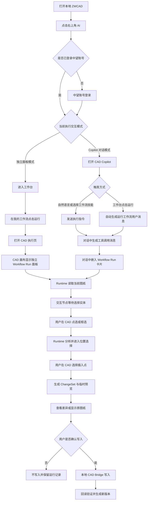
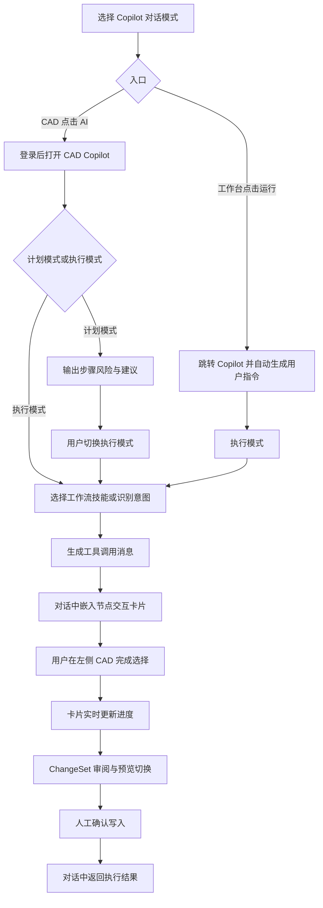
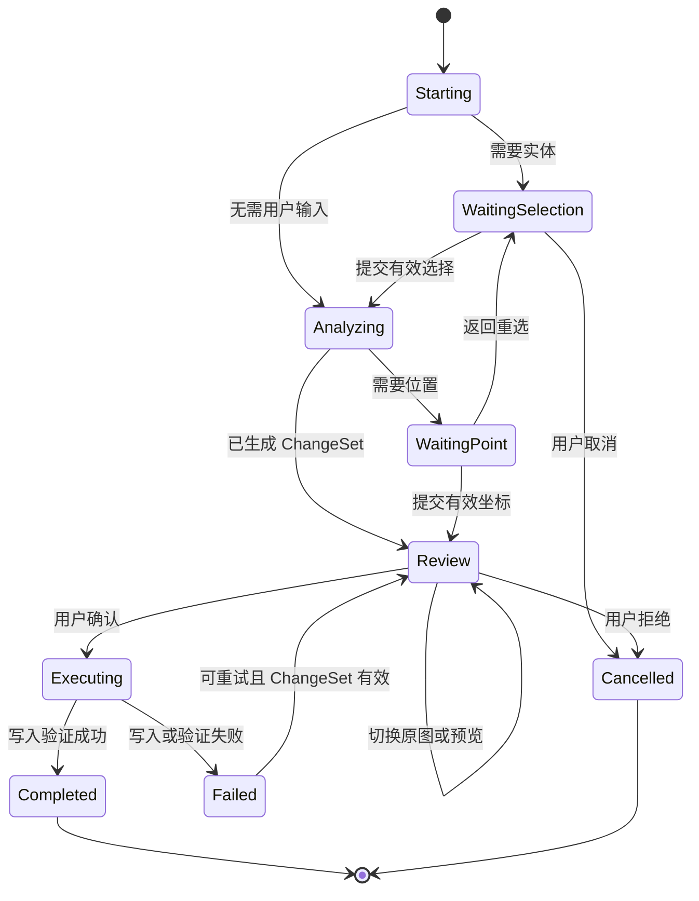
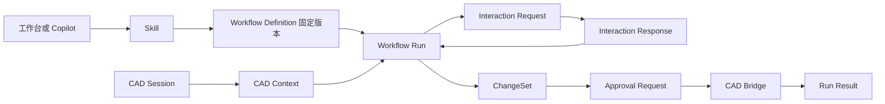

# CAD WorkFlow平台 1.0 产品需求文档

> 文档类型：用户前台类（包含工作流列表、CAD 本地交互与管理后台）

> 文档状态：评审稿

> 当前版本：V1.0

> 更新日期：2026-08-20

> "原型基线：当前仓库 `src/App.jsx`、`src/styles.css`、`src/api.js`"

> 重点范围：独立面板模式、Copilot 对话模式、两种模式共用的本地 CAD 交互闭环

## 0. 文档说明

### 0.1 编写目的

本文档用于明确 CAD WorkFlow平台 1.0 的产品范围、用户核心使用路径、两种工作流执行交互模式、页面与状态要求、数据契约、异常处理和验收口径，作为产品、设计、前端、CAD 插件、Workflow Runtime、服务端与测试团队的共同实施依据。

本次在标准 PRD 模板之外，新增“用户核心使用路径图”章节，重点回答：

- 用户从本地 CAD、工作台或 Copilot 发起工作流后，如何进入同一执行流程。
- 工作流运行到需要用户操作的 CAD 节点时，如何引导用户选择图纸、实体、位置或对象。
- 独立面板模式与 Copilot 对话模式的差异在哪里，哪些能力必须共用。
- CAD 写入前如何生成 ChangeSet、预览差异并完成本地人工确认。

### 0.2 需求依据

| 依据 | 说明 |
| --- | --- |
| 当前页面实现 | 以 `src/App.jsx` 中 1.0 导航、工作台、本地 CAD、Copilot、工作流运行卡片及路由实现为基线 |
| 当前交互样式 | 以 `src/styles.css` 中独立面板、Copilot 停靠栏、节点交互卡片和 CAD 画布状态样式为基线 |
| 当前接口约定 | 以 `src/api.js` 中工作流校验、保存、运行、确认和 SSE 事件约定为基线 |
| 已确认产品决策 | 1.0 提供“独立面板模式 / Copilot 对话模式”二级 Tab；所有 CAD 写入必须经过 ChangeSet 与本地人工确认 |
| 缺失资料 | 仓库未发现独立 `spec.md`、`content.md` 或页面截图文件，因此以可运行原型与产品约定为准 |

### 0.3 术语

| 术语 | 定义 |
| --- | --- |
| Workflow Definition | 可执行工作流定义，包含节点、连接、参数、版本及权限信息 |
| Skill | 面向 Agent/Copilot 暴露的能力描述，绑定已发布 Workflow Definition 版本 |
| Workflow Run | 一次不可变的工作流执行记录，关联工作流版本、CAD Context 和执行状态 |
| CAD Session | 本地 CAD 客户端与平台之间的活动连接，提供当前文档、版本、选择集和写入能力 |
| CAD Context | 本次任务使用的图纸、布局、视口、选择实体和坐标等上下文快照 |
| ChangeSet | 工作流拟对 CAD 图纸执行的结构化变更集合，是预览、审批、执行和审计的最小单元 |
| CAD 交互请求 | 工作流节点进入等待态后，向用户发出的选择图纸、实体、位置、参数或确认对象请求 |
| 独立面板模式 | 不展示 Copilot，对节点交互仅使用 CAD 画布上的工作流面板 |
| Copilot 对话模式 | 通过对话或工作台指令触发工作流，节点交互卡片嵌入 Copilot 对话线程 |

### 0.4 文档阅读顺序与本轮审校结论

本版按研发、设计和测试的常规阅读顺序组织：

- 文档说明、背景目标、角色场景：明确为什么做、为谁做、做到什么程度。
- 信息架构与核心路径：明确页面边界、入口、两种模式差异和共用路径。
- 共用执行底座与模式页面：先定义共用状态和交互协议，再分别说明独立面板、Copilot、CAD 登录页面。
- 工作台、Workflow 编辑器与管理后台：按页面说明内容、按钮、状态、异常和验收。
- 数据模型、接口、状态错误、埋点和非功能：明确研发实现约束和可观测性。
- 验收、原型一致性、发布建议和待确认事项：作为交付检查和版本决策依据。

本轮审校重点检查 1.0 原型中的每个页面、主要区域、按钮、展示字段和内容逻辑。页面级功能规格统一使用“展示内容 / 按钮行为 / 内容逻辑 / 状态与异常 / 验收”五个维度描述；其中具体页面章节是研发测试的最终口径，核心路径图用于理解跨页面跳转。

### 0.5 1.0 页面、按钮与内容逻辑总览

| 页面/模块 | 主要展示内容 | 主要按钮及行为 | 关键内容逻辑 | 对应章节 |
| --- | --- | --- | --- | --- |
| 顶部范围与执行模式（实际开发不涉及） | 1.0/全部范围、独立面板模式、Copilot 对话模式 | 点击范围切换不同版本产品导航；点击模式保存偏好并影响下一次运行 |  | §3.3、§4.4 |
| 工作台·我的工作流 | 工作流名称、描述、状态、节点数、运行次数、更新时间 | 新建、导入、打开、运行、导出；运行只创建 Run，不触发卡片打开 | 运行携带 workflow、run、mode；草稿只能调试，发布版本才能正式调用 | §9.2 |
| 工作台·官方模板 | 模板名称、描述、节点数、兼容版本、权限与官方标识 | 预览查看结构；使用/下载使用复制为本地草稿 | 不修改官方原件，复制生成新 ID；兼容性或权限失败不得生成半成品 | §9.3 |
| 工作台·运行记录 | 固定版本、图纸、来源、状态、耗时、ChangeSet、确认结果 | 详情、恢复、查看 ChangeSet、导出日志 | 两种模式进入同一列表；取消不计失败；等待用户可恢复 | §9.4 |
| 本地 CAD | ZWCAD、当前 DWG、连接状态、画布、状态栏、AI 入口 | AI 打开登录或进入目标能力；关闭留在 CAD | 两种模式都要先登录；节点结束恢复 CAD 原生状态 | §8 |
| 中望登录 | 账号、密码、登录目标、提交和关闭 | 登录并继续校验必填字段并进入对应模式；关闭留在 CAD | 登录成功后校验账号、工作流、Skill 和图纸权限 | §8.3–§8.5 |
| 独立面板运行（二选一） | 工作流、版本、图纸、步骤、交互指引、风险、ChangeSet | 完成选择、清除重选、返回、取消、查看差异、显示原图纸、确认并执行 | 面板控制任务，CAD 负责空间选择；不展示 Copilot 能力界面 | §6 |
| Copilot 对话运行（二选一） | 用户消息、助手消息、Tool Call、内嵌 Run 卡片、CAD 上下文 | 计划/执行切换、+ 选择能力、标签移除、发送、关闭、工作台 | 工作台运行等价于生成一条用户指令；卡片嵌入线程，空间选择发生在 CAD | §7 |
| Workflow 编辑器 | 顶部操作栏、节点库、画布、属性、调试、版本 | 新增、搜索、导入、连接、删除、保存、调试、发布、运行、版本、AI 助手 | 草稿编辑与正式版本分离；运行遵循当前 1.0 模式和 ChangeSet 确认 | §9.5 |
| 管理后台 | 用量、成员、授权、调用日志、写入审计 | 筛选、查看详情、管理角色与授权、查看 ChangeSet 审计 | 只治理身份、权限、版本和审计，不参与本地 CAD 实际执行 | §10 |

## 1. 产品背景与目标

### 1.1 背景问题

CAD行业痛点场景：

1、CAD 重复操作多，设计师时间消耗严重：将设计师的多个绘图操作封装为工作流，让AI智能化操作。

2、企业规范依赖人工检查，质量难以统一：把企业规范转化为AI知识库构建AI审查工作流。

3、传统CAD 自动化过度依赖专业开发人员：通过低代码工作流的方式，让业务设计师不需要编写底层 代码，也能够参与自动化流程建设。

4、通用AI 能理解需求，但缺少可靠的 CAD 执行能力：目前通用大模型/agent平台主要围绕文本、图片和信息传递设计，缺少 CAD 的专业对象和执行能力。

5、企业自动化能力难以沉淀和复用：当前企业中的高效方法经常存在于某个设计师/工程师/项目定制插件容易随人员流动流失，企业可以把优秀设计师的经验转化为标准化工作流。

### 1.2 产品目标

- 用户可以基于工作流平台把日常重复的工作编排成工作流，然后稳定高效执行。
- 用户从本地 CAD 软件进入 AI 能力，并在进入工作台或 Copilot 前完成中望账号登录。
- 工作流到达交互节点时，Runtime 可暂停，在 CAD 中给出明确、可操作、可恢复的选择指引。
- 工作台运行与 Copilot 对话调用复用同一 Workflow Run、CAD Context 与 ChangeSet 执行底座。
- 读取与分析可自动执行；任何 CAD 写入均须先预览，再由本地用户明确确认。
- 用户在执行工作流时能理解当前工作流、图纸、进度、等待原因、已选内容、拟写入内容和结果。

## 2. 用户角色与核心场景

### 2.1 用户角色

| 角色 | 目标 | 主要入口 | 关键关注点 |
| --- | --- | --- | --- |
| CAD 设计师 | 执行规范检查、图层清理、标注补全 | 本地 CAD、工作台、Copilot | 不离开图纸、指引清晰、写入安全 |
| 工作流搭建者 | 创建、调试、发布并验证工作流 | 工作台、Workflow 编辑器 | 节点输入输出、交互配置、版本一致性 |
| 企业管理员 | 查看账号、用量、日志和权限 | 管理后台 | 调用来源、失败原因、审计 |
|  |  |  |  |

### 2.2 核心使用场景

- 设计师在本地 CAD 点击“AI tab”，登录后进入web工作台，选择工作流运行，运行时在 CAD 软件内完成实体和位置选择。
- 设计师在本地 CAD 点击“AI tab”，登录后打开本地Copilot，通过自然语言调用工作流，交互卡片出现在对话中。
- 用户在工作台搭建工作流，通过模板或者空白新建工作流，用户在画布区对工作流进行编排调试。
- 用户在 Copilot 中可以选择工作流技能；执行模式下执行工作流，计划模式下只输出步骤与风险。
- 结果预览确认，工作流运行后产生的变更，用户在 CAD 画布切换“改动效果预览 / 原图纸”，确认后才写入。

## 3. 1.0 信息架构与范围

### 3.1 全局层级

```text
CAD WorkFlow平台
├─ 产品范围：1.0 / 全部
├─ 1.0 执行交互模式
│  ├─ 独立面板模式
│  └─ Copilot 对话模式
└─ 1.0 左侧导航
   ├─ 工作台
   │  ├─ 我的工作流
   │  ├─ 官方模板
   │  └─ 运行记录
   ├─ 管理后台
   └─ CAD
```

### 3.2 页面与路由

| 页面 | 当前路由 | 1.0 作用 |
| --- | --- | --- |
| 工作台 | `/` | 管理、创建、导入和运行工作流 |
| 本地 CAD 模拟页 | `/cad` | 模拟 ZWCAD 客户端与 AI 入口 |
| CAD 执行页 / Copilot | `/copilot` | 承载 CAD 画布、独立面板或 Copilot 对话 |
| Workflow 编辑器 | `/workflows/:id/editor` | 本地编排、调试、版本与执行确认 |
| 管理后台 | `/web/admin` | 账号用量、调用日志和权限治理 |

### 4. 用户核心使用路径图

### 4.1 总体核心路径



### 4.2 独立面板模式路径


关键原则：

- 页面不展示 Copilot 标题、消息、输入框、会话历史或技能选择器。
- 工作流面板是任务控制区，CAD 画布是空间交互区。
- 用户无需理解 Agent、MCP 或提示词即可完成工作流。
- 面板关闭等同取消或暂停当前 Run，不得隐式继续。

### 4.3 Copilot 对话模式路径



关键原则：

- 工作台点击“运行”等价于用户在 Copilot 输入“运行工作流「名称」”。
- 自动生成的用户消息、工具调用消息和节点交互卡片须保持顺序。
- 节点卡片融入对话，但空间选择仍发生在 CAD 画布。
- 计划模式不得产生副作用；执行模式才可调用工作流技能。

### 4.4 两种模式对照

| 对比项 | 独立面板模式 | Copilot 对话模式 |
| --- | --- | --- |
| 目标用户 | 习惯明确能力和功能按钮点击 | 希望用自然语言组合能力 |
| 主要触发 | 工作台卡片“运行” | Copilot 指令、技能或工作台“运行” |
| 运行容器 | CAD 画布独立面板 | 对话线程内嵌卡片 |
| 是否展示对话 | 否 | 是 |
| 工作台运行语义 | 直接创建 Run | 生成用户消息后调用工具并创建 Run |
| CAD 上下文选择位置 | CAD 软件图纸 | CAD 软件图纸 |
| ChangeSet 与确认 | 有 | 有 |
|  |  |  |

## 5. 工作流执行

### 5.1 Workflow Run 状态机



### 5.2 标准运行阶段

| 阶段 | 用户可见状态 | Runtime 行为 | 用户操作 |
| --- | --- | --- | --- |
| Starting | 正在连接 CAD 会话 | 校验版本、连接、图纸和权限 | 等待或取消 |
| WaitingSelection | 等待选择实体 | 创建 SelectionRequest 并暂停节点 | 点选/框选、清除、取消 |
| Analyzing | 正在分析已选对象 | 读取实体、规则和知识库 | 等待或取消 |
| WaitingPoint | 等待选择插入位置 | 创建 PointRequest，开启捕捉和临时预览 | 点击位置、返回、取消 |
| Review | 等待变更确认 | 固化 ChangeSet，生成 before/after | 查看差异、确认、取消 |
| Executing | 正在写入并验证 | 校验确认，通过 CAD Bridge 写入并回读 | 查看进度 |
| Completed | 执行完成 | 保存结果、版本和日志 | 查看结果、返回 |
| Failed | 执行失败 | 保存失败节点、错误码和上下文 | 重试、回退、取消 |

### 5.3 CAD 交互请求模型

"每个需要人工输入的节点必须输出统一 `InteractionRequest`，而非直接控制 UI。"

| 字段 | 类型 | 必填 | 说明 |
| --- | --- | --- | --- |
| `request_id` | string | 是 | 交互请求唯一标识 |
| `run_id` | string | 是 | 关联 Workflow Run |
| `node_id` | string | 是 | 关联当前节点 |
| `type` | enum | 是 | `drawing`、`entity_selection`、`point`、`object_create`、`parameter`、`approval` |
| `title` | string | 是 | 面向用户的任务标题 |
| `instruction` | string | 是 | 用户在哪里、选择什么、如何完成 |
| `constraints` | object | 否 | 类型、数量、图层、闭合性、坐标系等 |
| `current_value` | object | 否 | 当前选择数量、坐标或参数 |
| `allow_reset` | boolean | 是 | 是否允许清除重选 |
| `allow_cancel` | boolean | 是 | 是否允许取消运行 |
| `expires_at` | datetime | 否 | 请求失效时间 |

### 5.4 交互类型

| 类型 | CAD 行为 | 卡片内容 | 完成条件 |
| --- | --- | --- | --- |
| 选择图纸 | 读取当前文档或打开文件选择 | 图纸、版本、来源、重连 | 图纸可读且版本有效 |
| 选择实体 | 启用点选/框选与过滤 | 类型、数量、已选数、清除 | 选择集通过校验 |
| 选择位置 | 启用十字光标与对象捕捉 | 目标、坐标系、预览状态 | 返回有效坐标 |
| 创建对象 | 显示类型与创建参数 | 图层、样式、尺寸、基点、角度 | 参数完整合法 |
| 输入参数 | 表单或快捷选项 | 字段、单位、默认值、范围 | 必填字段合法 |
| 人工确认 | 锁定 ChangeSet | 风险、对象数、摘要、差异 | 用户确认或拒绝 |

### 5.6 运行卡片公共信息

两种容器均须展示：

- 工作流名称、状态和取消入口；
- 当前图纸与不可变工作流版本；
- 总步骤、当前步骤和进度；
- 当前交互请求、约束和已选结果；
- “读取/分析自动执行，写入需确认”的说明；
- ChangeSet 摘要、风险和影响对象；
- 完成结果、验证对象数、图纸新版本或失败原因。

### 5.7 ChangeSet 与预览

| 要求 | 说明 |
| --- | --- |
| 生成时机 | 所有可能写入 CAD 的节点完成 dry-run 后 |
| 不可变性 | Review 后内容和哈希不得静默修改；输入变化须生成新版本 |
| 摘要 | 按图层、创建、删除、属性修改等类型聚合 |
| 风险 | 至少低、中、高风险及对应说明 |
| 查看差异 | CAD 显示修改后效果，按钮改为“显示原图纸” |
| 显示原图纸 | CAD 恢复原图，按钮改回“查看差异” |
| 状态同步 | 按钮、画布、预览角标由同一 `previewVisible` 驱动 |
| 写入确认 | 只有“确认并执行”可产生 Approval Request |
| 原图保护 | 默认生成新版本或可回滚事务，不可逆覆盖被禁止 |

### 5.8 取消、关闭与恢复

- 在 WaitingSelection、WaitingPoint、Review 关闭运行卡片时，须确认暂停或取消。
- 取消后释放 CAD 选择模式、临时图元、捕捉状态和锁。
- "页面中断但 Runtime 仍存在时，应通过 `run_id` 恢复等待节点。"
- Executing 阶段不能通过简单关闭制造未知状态；等待事务返回。
- Completed 和 Cancelled 均进入运行记录；Cancelled 不计成功。

## 6. 工作流运行交互模式一：独立面板

### 6.1 页面目标

为不需要对话能力的用户提供最短、确定的执行路径。用户从工作台选择工作流后，直接在 CAD 中按节点要求操作，不展示 Copilot 能力选择、历史、输入框或 Agent 状态。

### 6.2 入口与跳转

| 入口 | 前置条件 | 目标行为 |
| --- | --- | --- |
| 顶部“独立面板模式” | 1.0 | 保存偏好，不立即启动 |
| 本地 CAD“AI” | 未登录 | 登录成功后进入工作台 |
| 工作台“运行” | 已选独立模式 | 跳转 `/copilot?workflow={id}&run=1&mode=standalone` |
| 已恢复 Run | 存在有效 `run_id` | 打开 CAD 执行页并恢复等待状态 |

### 6.3 布局要求

- 主体为 CAD 原生画图区，保留文件名、Ribbon、画布、状态栏和连接状态。
- 运行面板在 CAD 画布中停靠或浮动，不遮挡主要选择目标；建议支持拖动。
- 不渲染 Copilot 停靠栏，CAD 获得更大操作面积。
- WaitingSelection/WaitingPoint 时，画布显示与面板一致的轻量提示。
- Review 时，画布承担 before/after，面板承担摘要和确认。

### 6.4 运行交互

- 加载后创建 Run，显示“正在连接 CAD 会话”。
- 图纸读取完成后进入实体选择，CAD 激活点选/框选。
- 已选数量实时更新；有效时自动提交或点击“完成选择”。
- Runtime 分析后，如需位置则切换为位置拾取。
- 点击插入点后生成临时预览与 ChangeSet。
- 用户可反复切换修改预览和原图。
- 用户确认后写入，完成后显示验证结果与返回入口。

### 6.5 状态与异常

| 场景 | 页面反馈 | 可用操作 |
| --- | --- | --- |
| 未选择工作流 | 不进入执行页 | 返回工作台 |
| CAD 未连接 | 显示连接失败，不进入选择 | 重连、返回 |
| 当前无图纸 | “未检测到活动图纸” | 打开图纸、重检 |
| 选择不合法 | 高亮对象，说明类型/数量约束 | 清除、重选 |
| 版本下架 | Run 创建失败 | 返回、更新版本 |
| ChangeSet 失败 | 保留已选上下文和失败节点 | 重试、取消 |
| CAD 写入失败 | 回滚并显示失败对象 | 重试、导出日志 |

### 6.6 验收

- 不出现 Copilot 标题、聊天、输入框、历史或技能选择器。
- 工作台运行后及时出现准备状态；连接失败不得进入选择。
- 实体和位置均在 CAD 完成，结果实时反映在面板。
- 所有写入前必须出现 Review 和“确认并执行”。
- 预览切换按钮与画布始终同步。
- 取消后 CAD 退出选择态且不写入。

## 7. 工作流运行交互模式二：Copilot 对话模式

### 7.1 页面目标

以 CAD Copilot 作为主 Agent 入口。Copilot 理解目标、组合知识库（1.0可能先不做知识库）与已发布工作流技能、提供计划模式和执行模式，分别用于仅输出计划和直接执行任务；到达交互节点时，运行卡片嵌入对话线程，引导用户在左侧 CAD 图纸界面完成实体对象选择。

### 7.2 入口与跳转

| 入口 | 前置条件 | 目标行为 |
| --- | --- | --- |
| 本地 CAD“AI” | Copilot 模式 | 登录后进入 `/copilot?mode=copilot&source=cad` |
| 工作台“运行” | Copilot 模式 | 进入 `/copilot?workflow={id}&run=1&mode=copilot` |
| Copilot 指令 | 已登录且 CAD 已连接 | 根据计划/执行模式响应 |
| “+”选择工作流技能 | 有发布的工作流 | 将选中的工作流作为本次任务中强制执行的流程 |

### 7.3 工作台中直接运行工作流等价语义

工作台点击“运行”某条工作流后，Copilot 中自动发送指令：

- "指令消息：`运行工作流「{工作流名称}」`"

### 7.4 页面结构

| 区域 | 内容 | 操作 |
| --- | --- | --- |
| 左侧 CAD软件图纸区域 | 图纸、选择高亮、位置提示、预览角标 | 选实体、选位置、看 before/after |
| 对话头部 | CAD Copilot、工作台、历史、新会话、关闭 | 返回、管理和关闭 |
| 图纸上下文 | 当前 DWG、连接、已选实体 | 清除实体上下文 |
| 对话线程 | 用户、助手、工具调用、Run 卡片 | 回看链路、操作卡片 |
| 模式切换 | 计划模式、执行模式 | 控制是否调用工作流 |
| 本轮上下文 | 知识库和工作流技能标签 | 添加、移除 |
| 输入区 | “+”、提示词补全、发送 | 输入任务、选择能力 |

### 7.5 计划模式

- 输出步骤、风险、所需图纸上下文和建议技能。
- 可读取 CAD Context 摘要，不得执行写图节点。
- 不创建有副作用的 Workflow Run。
- 提示用户切换执行模式或提供“按此计划执行”。

### 7.6 执行模式

- 根据意图匹配已有的确定工作流。
- 调用前校验 已有固定工作流版本及 CAD Session。
- 创建 Tool Call 并发起 Workflow Run。
- 运行卡片插在工具调用消息后，不使用独立漂浮卡片。
- 到达交互节点时卡片说明任务，CAD 高亮操作区域。
- 生成 ChangeSet 后在卡片内预览和确认。

### 7.7 “+”能力选择器

一级菜单仅包含“知识库”和“工作流技能”。

- 知识库显示名称和索引状态；“新建知识库”为弱化入口。（1.0版可能不做知识库）
- 工作流技能只显示已授权、已发布 Skill，展示名称、描述、连接状态。
- “新建工作流技能”为弱化入口，跳转工作流中心。
- 已选技能以输入框内“本轮上下文”标签展示，发送前可移除。

### 7.8 关闭与返回界面

- "从本地 CAD 进入，关闭返回 `/cad`。"
- "从工作台进入，关闭返回 `/`。"
- "头部“工作台”入口始终返回 `/`。"
- 有未完成 Run 时关闭须确认暂停；Executing 按共用规则处理。
- 新建会话不应静默取消 Run；如暂不支持跨会话须明确提示。

### 7.9 session管理

### 7.9 状态与异常

| 场景 | 页面反馈 | 可用操作 |
| --- | --- | --- |
| 无工作流技能 | 技能菜单空态 | 跳转工作流中心 |
| 计划模式要求执行 | 只输出计划并解释不会写图 | 切换执行模式 |
| 命中多个 Skill/工作流 | 展示候选及差异 | 用户选择 |
| Skill/工作流 无权限/下架 | 工具调用失败，不创建 Run | 重新授权/选择 |
| CAD 未连接 | Run 停在 Starting | 重连、返回 CAD |
| 会话刷新 | 恢复消息和 Run 卡片 | 继续交互 |
| 对话服务失败 | 保留 CAD 与本地 Run | 重试对话、直接操作卡片 |

### 7.10 验收

- 工作台运行后自动出现用户指令、工具调用和内嵌卡片。
- 卡片属于对话内容的一部分，随线程滚动。
- 计划模式不得写图；执行模式仍需 ChangeSet 确认。
- CAD 选择后卡片进度与数量同步。
- 头部无冗余副标题，包含工作台入口和关闭。
- "`source=cad` 关闭返回 CAD，其他入口返回工作台。"

## 8. 本地 CAD 与登录

### 8.1 页面目标

模拟并最终映射真实 ZWCAD 客户端，提供明确、低干扰的 AI 入口。AI 根据当前模式进入工作台或 Copilot，但两种模式均先完成中望账号登录，具体的登录方式和目前中望账号登录方式保持一致即可。

### 8.2 登录弹窗（中望账号登录方式和界面保持一致即可，下方字段仅部分距离）

| 字段 | 类型 | 校验 |
| --- | --- | --- |
| 中望账号 | 文本 | 必填，支持企业账号格式 |
| 密码 | 密码 | 必填，不记录明文 |
| 登录目标 | 只读 | 独立模式“进入工作台”；Copilot“打开 CAD Copilot” |
| 登录并继续 | 主按钮 | 字段合法且未提交时可用 |
| 关闭 | 图标 | 留在 CAD，不改变模式 |

### 8.4 登录成功去向

| 当前模式 | 目标 | 后续 |
| --- | --- | --- |
| 独立面板 | 工作台 `/` | 用户选择工作流运行 |
| Copilot 对话 | `/copilot?mode=copilot&source=cad` | 连接图纸并显示欢迎消息 |

### 8.5 验收

- 已登录用户点击 AI 可直接进入；切换账号后重校验权限。
- 未登录用户不能进入工作流平台和copilot界面

## 9. 工作台

### 9.1 页面目标

工作台是工作流资产与运行入口，提供“我的工作流 / 官方模板 / 运行记录”三个二级 Tab。原型导航层级与内容章节应一致。

### 9.2 我的工作流

目标：展示用户可编辑、调试和运行的本地工作流。

| 字段/操作 | 要求 |
| --- | --- |
| 状态 | 草稿、已发布、已下架；影响可调用能力 |
| 名称/描述 | 展示工作流的名称，可根据工作流名称搜索。展示工作流用途描述 |
| 运行次数/更新时间 | 展示累计运行次数和最近修改时间 |
| 新建 | 空白创建、模板创建、AI 辅助创建 |
| 导入 | 本地选择 工作流文件 并校验契约 |
| 打开 | 进入 Workflow 编辑器 |
| 运行 | 按当前模式进入独立或 Copilot 路径 |
| 导出 | 导出 `.json`(bisheng导出的是json文件、dify导出的是dsl文件) |

状态与异常：

- 空态提供新建与导入。
- 搜索无结果可清除搜索。
- 导入失败显示格式、版本或节点错误。
- 草稿可在编辑器调试；正式运行使用已发布版本。

验收：

- 点击“运行”不触发卡片打开。
- 不同模式跳转参数正确，工作流 ID 一致。
- 导入通过校验后进入编辑器，失败不创建脏数据。

### 9.3 官方模板

目标：帮助用户预览并复用官方 CAD 场景模板。

| 字段/操作 | 要求与作用 |
| --- | --- |
| 名称/描述 | 明确场景和产出 |
| 节点数量 | 展示模板的复杂度 |
| 官方标识 | 与用户工作流区分 |
| 预览 | 展示在画布上的交互节点结构 |
| 使用 | 复制为本地工作流，再进入编辑器 |

验收：

- 用户使用模板不会修改官方原件。
- 复制后生成新工作流 ID 和草稿。
- 用户使用前可以直接预览画布的节点结构

### 9.4 运行记录

目标：回看每次运行的图纸、来源、状态、耗时、用量和确认结果。

| 字段 | 含义 |
| --- | --- |
| 工作流 | 工作流的名称 |
| 图纸 | 图纸的文件名 |
| 触发来源 | 人工执行、Copilot、API、MCP |
| 状态 | 运行中、等待用户、待确认、成功、失败、取消 |
| Token用量 | 运行一次该工作流所产生的Token消耗 |
| 运行时间 | 展示该工作流开始运行的时间，但后台需要同时记录开始和结束的时间 |
|  |  |

状态与异常：

- 空态引导用户运行工作流。

### 9.5 Workflow 编辑器与节点体系（补充）

#### 9.5.1 页面目标与编辑器布局

Workflow 编辑器是工作流定义的本地编排工作区，负责节点添加、流程连线、节点参数配置、端口契约检查、调试、版本管理、发布和运行。编辑器中产生的内容最终保存为 Workflow Definition，不直接绕过运行确认机制写入 CAD。

编辑器采用“顶部操作栏 + 左侧节点库 + 中间画布 + 右侧节点属性 + 底部调试面板”的布局：

| 区域 | 核心内容 | 主要操作 |
| --- | --- | --- |
| 顶部操作栏 | 产品/端侧标识、面包屑、工作流名称、草稿/已发布状态 | 保存草稿、版本、调试、发布、运行 |
| 左侧节点库 | CAD、AI、逻辑节点分组、搜索、第三方节点导入 | 单击添加、拖拽添加、搜索、导入 |
| 中间画布 | 节点、端口、连线、状态、缩略图、画布工具 | 移动、连接、删除、缩放、适配 |
| 右侧节点属性 | 配置、输出、日志三个 Tab | 修改配置、查看端口、单步调试 |
| 底部调试面板 | 编译结果、运行日志、节点状态、执行确认入口 | 查看日志、调整高度、进入审阅 |

页面状态：

- 空白画布：显示节点库和“新增节点”引导，不生成虚假流程。
- 草稿：可保存、调试和本地运行；显示“草稿 · 仅可调试”。
- 已发布：显示正式版本，可被插件端、Agent、API 和 MCP 调用。
- 编译/运行中：锁定会影响当前运行的结构操作，并持续显示节点状态。
- 编译失败：定位错误节点、端口或变量引用，禁止进入正式运行。

#### 9.5.2 节点库

节点库支持搜索、分组浏览、单击添加、拖拽定位和第三方节点导入。1.0 的节点分类与范围如下：

| 节点组 | 1.0 节点范围 | 典型用途 |
| --- | --- | --- |
| CAD 节点 | CAD 图纸读取、获取实体对象、CAD 查询、查询实体属性、创建几何/填充/文字/标注、修改实体属性、综合编辑、打印文件、预览确认、CAD 写入 | 读取本地 CAD、查询对象、生成和修改图元 |
| AI 节点 | LLM、问题分类器、文字检测识别、表格检测识别、机械符号检测识别、图框检测、版面分割 | 理解任务、识别图纸内容、输出结构化问题 |
| 逻辑节点 | 条件分支、迭代循环、代码节点、人工介入、HTTP 请求 | 组织条件、批量处理、等待确认、调用外部服务 |

节点库规则：

- 搜索只过滤节点库，不影响画布中已经编排的节点。
- 单击节点添加到画布默认位置；拖拽节点放置到用户指定位置。
- 节点导入使用本地文件选择，支持约定的第三方节点包格式，并显示“节点导入中”反馈。
- 导入成功后节点进入可配置状态；导入失败说明文件格式、版本或端口契约问题。
- 1.0 对暂不支持的节点类型应在节点库中明确标识，不允许以可执行状态出现。

#### 9.5.3 画布编排与连线

画布使用可视化流程编排方式承载 Workflow Definition：

| 功能 | 需求 |
| --- | --- |
| 选中节点 | 显示彩色外框、光晕和标题背景，右侧打开节点属性 |
| 移动节点 | 支持拖动，保存节点位置，不改变节点 ID、输入输出和业务配置 |
| 新增节点 | 支持从节点库拖拽、单击添加和画布工具“新增节点” |
| 连接节点 | 从输出端口连接到输入端口，保存 source、target 和端口信息 |
| 删除节点 | 删除节点及其关联边，并清除选中态 |
| 画布视图 | 支持放大、缩小、适配画布和缩略图；缩略图不得遮挡主要编排区 |
| 运行状态 | 节点可显示空闲、成功、警告、运行中和失败状态 |

连线校验：

- 输入端口、输出端口和数据类型必须可解析。
- 不允许连接不存在的节点或端口。
- 运行前检查未连接的必填输入、孤立节点、循环依赖和不完整分支。
- 节点被删除时，关联边必须一并删除。
- 保存前可保留草稿状态；发布前必须通过编译校验。

#### 9.5.4 节点属性配置

选中节点后，右侧展示“配置 / 输出 / 日志”三个 Tab。不同节点类型必须展示对应的专业配置，而不是统一的大模型表单。

| 节点类型 | 必备配置 |
| --- | --- |
| CAD 图纸读取 | 文件来源、云空间具体版本或本地 CAD 当前图纸、读取范围、选择集/模型空间/图层/对象类型 |
| CAD 实体选择与查询 | 选择方式、实体类型、图层、块、数量范围、查询条件和筛选变量 |
| CAD 创建/修改/写入 | 目标图纸、图层、对象属性、写入模式、dry-run 策略、执行前人工确认 |
| CAD 预览确认 | 修改前后对比、改动高亮、改动汇总、取消后的回流节点 |
| AI/LLM | 模型供应商、模型、提示词、MCP 工具、知识库、上下文变量、温度、最大 Token |
| AI 检测/分类 | 检测范围、识别内容、规则来源、识别模型、分类规则和输出格式 |
| 条件分支 | 判断变量、运算符、比较值、AND/OR 关系、true/false 下游路径 |
| 迭代循环 | 迭代数组、循环条件、循环体、最大次数和异常处理 |
| 人工介入 | 触发条件、确认说明、同意/拒绝方式、处理人和下一步结果 |
| HTTP 请求 | API 地址、方法、Headers、Body、Query、重试和证书验证 |

配置规则：

- 必填字段、格式、范围和依赖字段实时校验。
- CAD 本地来源必须显示连接成功状态、当前图纸和重新连接入口。
- 配置变化标记为未保存，保存失败时保留用户填写内容。
- 节点类型变化时，清理不再适用的字段，避免旧参数污染。
- 任何写入相关配置都必须显示“写入需人工确认”的安全说明。

#### 9.5.5 输出端口与数据契约

“输出”Tab 用于展示当前节点的输入端口、输出端口、类型契约和示例结果。

| 节点 | 典型输出 |
| --- | --- |
| CAD 图纸读取 | `drawing: object`、`selection_set: array<Entity>`、`entities: array<Entity>` |
| 获取实体对象 | `entities: array<Entity>`、`selection_set: array<Entity>`、`count: number` |
| CAD 查询 | `query_result: object`、`matched_entities: array<Entity>` |
| 查询实体属性 | `properties: array<EntityProperty>`、`geometry: array<Geometry>` |
| CAD 处理/修改 | `processed_entities`、`updated_entities`、`change_set` |
| 知识检索 | `results: Array<KnowledgeChunk>`、`retrieval_context: string` |
| LLM | `text: string`、`structured_result: object` |
| 人工介入 | `approved: boolean`、`comment: string` |
| 预览确认 | `approved: boolean`、`preview: object`、`comment: string` |

端口要求：

- 输入端口展示名称、类型及未连接时的运行前校验说明。
- 输出端口支持复制端口名，供下游变量映射使用。
- 端口契约变更需要重新编译；类型不兼容时禁止发布。
- 实际运行后可在日志中查看端口的真实输入、输出、耗时和变量映射。

#### 9.5.6 编译、调试与运行

底部调试面板通过可拖动分隔线调节画布与调试区域高度。以下操作均应展开该面板：

- 点击“调试”；
- 点击“运行”；
- 点击节点属性中的“单步调试”；
- 工作流编译失败或节点执行失败；
- 运行生成 ChangeSet 并等待确认。

调试能力：

| 能力 | 需求 |
| --- | --- |
| 编译校验 | 校验节点连接、变量引用、必填配置、端口类型和执行权限 |
| 单步调试 | 只运行选中节点，显示实际输入、输出、耗时和错误 |
| 全流程调试 | 实时显示编译、节点开始、节点完成、节点失败等事件 |
| 日志 | 节点属性“日志”显示最近一次记录，支持查看完整节点日志 |
| 预览审阅 | 产生 CAD 写入时生成 dry-run ChangeSet，进入双图差异审阅 |
| 继续执行 | 只有用户完成人工确认后才提交 CAD 写入 |

运行规则：

- 点击运行先调用工作流校验接口。
- 校验不通过时停留在编辑器，定位具体问题。
- 校验通过后创建 Workflow Run，并通过事件流更新节点状态。
- 出现写入节点时暂停在确认态，生成 before/after 预览和 ChangeSet。
- "确认时提交 `run_id` 与 `preview_hash`；哈希不匹配时服务端拒绝写入。"
- 运行完成后保存结果、耗时、节点日志和图纸新版本。

#### 9.5.7 保存、版本与发布

| 操作 | 规则 |
| --- | --- |
| 保存草稿 | 保存当前节点、边、布局和配置，不生成正式调用版本 |
| 版本历史 | 抽屉展示版本号、说明、更新时间、节点数量和编辑人 |
| 发布 | 冻结当前草稿为正式版本，生成版本号并更新可调用状态 |
| 重新发布 | 基于当前草稿生成新正式版本，不覆盖历史版本 |
| 创建 Skill | 仅已发布工作流可封装为 Agent/Copilot Skill |
| 运行 | 按当前 1.0 执行模式进入独立面板或 Copilot |

版本要求：

- Workflow Run 必须关联不可变的工作流版本。
- 草稿保存后可继续编辑，正式版本不可被静默修改。
- API、MCP 和 Copilot 只能调用已发布、已授权版本。
- 发布失败时保留草稿和用户修改，不产生半发布状态。

#### 9.5.8 AI 工作流搭建助手

编辑器中的 AI 助手只负责工作流搭建，不执行 CAD 操作、不修改当前图纸：

- 用户用自然语言描述目标；
- AI 将描述解析为候选节点与连线；
- 生成结果追加到当前画布；
- 用户可以继续描述下一步、拖动节点、修改配置和删除结果；
- 无法识别时说明支持的工作流搭建范围；
- 生成过程显示分析中状态，完成后提示新增节点数量。

#### 9.5.9 编辑器验收标准

- 可从工作台进入指定工作流编辑器，并加载正确版本或空白画布。
- CAD、AI、逻辑节点分组、搜索、单击添加、拖拽添加和第三方节点导入均可用。
- 节点可移动、连接、删除、配置，且输出端口契约可查看。
- 右侧属性包含配置、输出、日志三个 Tab；日志支持单步调试。
- 调试面板可展开、关闭和拖动高度；编译失败时能定位问题。
- 保存草稿、查看版本、发布和运行的状态与按钮文案一致。
- 运行到 CAD 写入时必须进入 ChangeSet 审阅；未确认不得写图。
- 编辑器运行入口与 1.0 当前模式一致，不能绕过独立面板/Copilot 的执行规则。

## 10. 管理后台

1.0 的管理后台仅展示账号的套餐用量、每条工作流的资源消耗分布

### 10.1 资源种类

| 资源种类 | 说明 |
| --- | --- |
| 可创建工作流个数 | 用户可以在工作流平台上创建工作流的个数 |
| 可发布工作流个数 | 用户在工作流平台上发布正式工作流的个数，可发布上限会小于可创建上限 |
| 工作流执行次数 | 对于已发布的工作流运行的次数上限 |
| Token | 运行工作流时，里面的AI节点所产生的token消耗、以及copilot对话时产生的token消耗，这个token单位由中望自行定义，可与目前365的token单位保持一致 |
| 工作流最大并发执行数 | 这里主要用于API/MCP调用时的并发限制，CAD软件内执行只支持单个工作流执行，不支持多个工作流并行执行 |

### 10.1 资源明细

| 资源种类 | 说明 |
| --- | --- |
| 可创建工作流个数 | 点击展开一个已创建工作流的列表，列表字段：工作流名称、工作流创建时间 |
| 可发布工作流个数 | 点击展开一个已发布工作流的列表，列表字段：工作流名称、工作流最近发布时间 |
| 工作流执行次数 | 点击展开一个条形图，从多到少，展示每个工作流的执行次数 |
| Token | 点击展开一个条形图，从多到少，展示每个工作流的token消耗量 |
| 工作流最大并发执行数 | 点击展开一个列表，列表字段：工作流名称、曾最大的并发数 |

## 11. 数据模型与技术契约

### 11.1 核心对象关系



### 11.2 Workflow Run 字段

| 字段 | 类型 | 说明 |
| --- | --- | --- |
| `run_id` | string | 唯一 ID |
| `workflow_id` | string | 工作流 ID |
| `workflow_version` | string | 不可变版本 |
| `skill_id` | string/null | Copilot/Agent 调用时关联 |
| `trigger_source` | enum | `standalone`、`copilot`、`editor`、`api`、`mcp` |
| `conversation_id` | string/null | Copilot 会话 |
| `tool_call_id` | string/null | Copilot 工具调用 |
| `cad_session_id` | string | 本地 CAD 会话 |
| `cad_context_snapshot` | object | 图纸与选择上下文快照 |
| `status` | enum | 生命周期状态 |
| `current_node_id` | string/null | 当前节点 |
| `change_set_id` | string/null | 关联 ChangeSet |
| `created_by` | string | 发起用户 |
| `created_at/updated_at` | datetime | 时间戳 |

### 11.3 URL 与状态

| 参数/键 | 值 | 用途 |
| --- | --- | --- |
| `workflow` | workflow ID | 指定自动运行的工作流 |
| `run=1` | 标记 | 页面加载后启动 |
| `mode` | `standalone` / `copilot` | 呈现模式 |
| `source=cad` | 来源 | 决定关闭后返回 CAD |
| `cad-workflow-product-scope` | `1.0` / `all` | 产品范围偏好 |
| `cad-workflow-execution-mode` | 两种模式 | 执行偏好 |

"生产环境以 `run_id` 作为恢复深链；`run=1` 仅用于创建，避免刷新重复运行。"

### 11.4 当前接口

| 方法 | 路径 | 用途 |
| --- | --- | --- |
| POST | `/api/workflows/validate` | 校验节点图和端口 |
| POST | `/api/workflows` | 保存工作流 |
| POST | `/api/runs` | 创建 Workflow Run |
| POST | `/api/runs/{runId}/confirm` | 携带 `preview_hash` 确认 |
| GET/SSE | `/api/runs/{runId}/events` | 订阅事件 |

"当前事件：`run.started`、`node.started`、`node.completed`、`node.failed`、`run.awaiting_confirmation`、`run.completed`、`run.failed`、`cad.write_completed`。"

"建议补充：`run.awaiting_interaction`、`interaction.updated`、`interaction.completed`、`changeset.generated`、`changeset.preview_ready`、`approval.rejected`、`cad.write_rolled_back`。"

### 11.5 本地执行边界

- Web 服务负责身份、权限、版本同步、Skill 治理和审计。
- Local Workflow Runtime 负责节点执行和等待/恢复。
- CAD Bridge 负责读图、选择、临时预览、事务写入和验证。
- Copilot 负责理解、计划、能力选择和编排，不直接写 CAD。
- 云端 MCP 只作为可选服务节点，不能绕过本地 Approval Request。

## 12. 状态与错误处理

### 12.1 通用状态

| 状态 | 视觉要求 | 行为要求 |
| --- | --- | --- |
| 加载中 | 骨架或进度，避免空白 | 防重复发起 |
| 等待用户 | 强调节点和操作区域 | Runtime 暂停并保持心跳 |
| 无数据 | 原因与唯一主操作 | 不显示伪造记录 |
| 权限不足 | 说明缺少的权限 | 提供申请或返回 |
| 连接中断 | 保留 Run 和已提交输入 | 支持重连恢复 |
| 执行失败 | 节点、错误码、回滚 | 重试/导出日志 |
| 已取消 | 明确无写入或已回滚 | 可返回工作台 |

### 12.2 错误码

| 错误码 | 场景 | 用户提示 |
| --- | --- | --- |
| `AUTH_REQUIRED` | 未登录/失效 | 请登录中望账号 |
| `WORKFLOW_VERSION_UNAVAILABLE` | 下架/无权限 | 当前版本不可用 |
| `CAD_SESSION_DISCONNECTED` | CAD 断开 | 请重新连接当前 CAD |
| `CAD_DOCUMENT_CHANGED` | 图纸被切换/修改 | 上下文变化，请重新确认 |
| `SELECTION_INVALID` | 实体不满足约束 | 类型或数量不符合要求 |
| `INTERACTION_EXPIRED` | 请求过期 | 请重新开始本节点 |
| `CHANGESET_STALE` | 预览后原图变化 | 重新生成预览 |
| `APPROVAL_REQUIRED` | 无确认尝试写入 | 写图前必须本地确认 |
| `CAD_WRITE_FAILED` | 写入失败 | 已回滚，请查看失败对象 |

## 13. 埋点与度量

| 事件 | 关键属性 |
| --- | --- |
| `execution_mode_changed` | from、to、page、user_id |
| `cad_ai_clicked` | mode、login_state、cad_version |
| `login_completed` | mode、result、error_code |
| `workflow_run_requested` | workflow_id、version、source、mode |
| `workflow_run_started` | run_id、cad_session_id、source |
| `interaction_requested` | run_id、node_id、type、constraints |
| `interaction_completed` | duration、selection_count、retry_count |
| `changeset_preview_toggled` | visible、change_count、risk |
| `approval_submitted` | decision、user_id、preview_hash |
| `cad_write_completed` | result、object_count、rollback |
| `copilot_closed` | source、active_run_status、destination |

等待用户时间须与 Runtime 计算耗时分开，避免误判系统性能。

## 14. 非功能需求

### 14.1 性能

- 已连接时，创建 Run 到 Starting ≤ 1 秒。
- CAD 选择结果到卡片数量更新 ≤ 200ms。
- 节点事件到 UI 更新 ≤ 500ms。
- before/after 切换 ≤ 500ms；大图可渐进加载但须立即反馈。

### 14.2 安全

- 密码、Token、图纸敏感字段不得进入前端日志。
- "Approval 绑定 `run_id`、`change_set_id`、`preview_hash`、确认人和时间。"
- ChangeSet 改变后旧确认自动失效。
- CAD 写入使用事务，失败回滚。
- Copilot 文本不能视为确认，只有结构化操作有效。

### 14.3 可用性与可访问性

- "关键按钮有文本或 `aria-label`。"
- 当前步骤不只依赖颜色。
- 键盘可切换模式、关闭弹窗和操作主要按钮。
- 对话卡片窄屏可滚动，不遮挡输入区。
- 独立面板不得永久覆盖需要选择的 CAD 区域。

### 14.4 兼容性

- 发布计划列出支持的 ZWCAD 版本。
- CAD Bridge 声明图纸格式、对象类型和 API 范围。
- Web 原型支持 Chromium；真实插件以 ZWCAD 内嵌浏览器为准。

## 15. 验收用例

### 15.1 模式与登录

| 编号 | 前置条件 | 操作 | 预期 |
| --- | --- | --- | --- |
| AC-01 | 1.0、未登录 | 独立模式下 CAD 点击 AI | 登录成功后进入工作台 |
| AC-02 | 1.0、未登录 | Copilot 模式下 CAD 点击 AI | 登录成功进入 Copilot，URL 含 `source=cad` |
| AC-03 | 已选独立模式 | 刷新 | 模式保持 |
| AC-04 | Copilot 页面有 Run | 切换独立模式 | 当前 Run 不迁移；新 Run 使用独立模式 |

### 15.2 独立面板

| 编号 | 操作 | 预期 |
| --- | --- | --- |
| AC-10 | 工作台点击工作流“运行” | 打开 CAD，仅显示独立运行面板 |
| AC-11 | WaitingSelection 点击 CAD | 提交实体，数量更新，进入分析 |
| AC-12 | WaitingPoint 点击 CAD | 记录位置，生成 ChangeSet |
| AC-13 | 点击“查看差异” | 显示修改效果，按钮变“显示原图纸” |
| AC-14 | 点击“显示原图纸” | 恢复原图，按钮变“查看差异” |
| AC-15 | 未确认退出 | 不写图，释放交互态，记录取消/暂停 |
| AC-16 | 点击“确认并执行” | 产生 Approval，写入并显示验证结果 |

### 15.3 Copilot 对话

| 编号 | 操作 | 预期 |
| --- | --- | --- |
| AC-20 | 工作台点击“运行” | 自动生成用户、工具调用和内嵌 Run 卡片 |
| AC-21 | 计划模式输入规范化任务 | 只输出计划，不创建写图 Run |
| AC-22 | 执行模式选择 Skill 并发送 | 创建 Tool Call 和 Run |
| AC-23 | CAD 完成实体选择 | 对话卡片同步，不新增漂浮面板 |
| AC-24 | Review 切换预览 | 左侧 CAD 与卡片同步 |
| AC-25 | 从 CAD 进入后关闭 | 返回 `/cad` |
| AC-26 | 从工作台进入后关闭 | 返回 `/` |
| AC-27 | 点击头部工作台 | 返回 `/` |

### 15.4 安全与异常

| 编号 | 操作 | 预期 |
| --- | --- | --- |
| AC-30 | 无 Approval 调用写图 | CAD Bridge 拒绝，返回 `APPROVAL_REQUIRED` |
| AC-31 | 预览后修改原图再确认 | ChangeSet 失效，要求重新预览 |
| AC-32 | 选择非法实体 | 不推进节点，显示约束并允许重选 |
| AC-33 | 写入中 CAD 断开 | 失败并回滚，记录原因 |
| AC-34 | 页面刷新 | 用 `run_id` 恢复，不重复创建 |

## 16. 原型一致性与研发补齐

### 16.1 已与当前原型一致

- 1.0 顶部有“独立面板 / Copilot 对话”二级 Tab。
- 1.0 左侧导航为工作台、管理后台、CAD，CAD 位于最下方业务项。
- CAD 右上角按钮文案为“AI”。
- 两种模式点击 AI 均先显示中望账号登录。
- "工作台运行使用 `workflow`、`run=1`、`mode` 进入执行页。"
- 独立模式隐藏 Copilot 并显示独立运行面板。
- Copilot 模式将 Run 卡片嵌入对话线程。
- 工作台触发 Copilot 会自动生成“运行工作流”用户消息。
- 状态覆盖读取、实体选择、分析、位置、审阅、执行、完成。
- Review 已实现“查看差异 / 显示原图纸”切换。
- Copilot 有工作台、历史、新会话、关闭；从 CAD 进入关闭后返回 CAD。

### 16.2 研发必须补齐

| 编号 | 当前原型 | 生产需求 |
| --- | --- | --- |
| GAP-01 | 登录为模拟，可绕过 | 统一认证和路由守卫 |
| GAP-02 | Run 由前端定时器推进 | 接入 Local Runtime 与事件 |
| GAP-03 | 名称、图纸、版本有硬编码 | 从 Run 与 CAD Context 动态渲染 |
| GAP-04 | `run=1` 刷新可能重复 | 创建后改用 `run_id` |
| GAP-05 | ChangeSet 为视觉模拟 | 实现结构化 ChangeSet、hash、Approval 和事务 |
| GAP-06 | “返回工作流中心”当前可能进入编辑器 | 统一文案和目标，建议返回工作台/运行记录 |
| GAP-07 | 关闭直接取消 | 等待态与 Review 增加暂停/取消确认 |
| GAP-08 | Failed、重连、恢复不完整 | 按错误码补齐 |
| GAP-09 | URL 和本地模式并存 | 优先级：Run 固定 > URL > 账号偏好 > 默认 |
| GAP-10 | 新会话与活动 Run 未定义 | 定义跨会话运行或先处理规则 |

### 16.3 一致性结论

当前原型已验证两种模式的主要信息架构和核心操作闭环，可作为 1.0 评审和可用性测试基线；账号认证、真实本地 Runtime、InteractionRequest 协议、ChangeSet 安全确认、恢复与错误处理仍属于正式研发交付，不能将原型定时器和静态数据视为最终技术方案。

## 17. 发布建议

| 阶段 | 交付 |
| --- | --- |
| M1：交互协议 | Run 状态机、InteractionRequest/Response、CAD Context、事件协议 |
| M2：独立面板 | 登录、工作台运行、实体/位置、ChangeSet、确认写入 |
| M3：Copilot 融合 | 对话触发、Skill、内嵌卡片、计划/执行、会话关联 |
| M4：稳定治理 | 恢复、回滚、运行记录、管理日志、权限、埋点 |

上线门槛：

- AC-01 至 AC-34 的 P0/P1 用例全部通过。
- 未确认写入安全测试 100% 通过。
- CAD 写入失败可回滚，不破坏原图。
- 两种模式在同一工作流与 CAD Context 下生成一致 ChangeSet。
- 管理后台可追踪来源、版本、确认人和写入结果。

## 18. 评审待确认事项

- 独立面板在真实 ZWCAD 中采用右侧停靠、浮动窗口还是可拖动覆盖卡片。
- 实体选择完成是自动提交，还是点击“完成选择”；建议节点配置支持两种策略。
- 等待用户的 Run 保留时长，以及 CAD 关闭后的恢复策略。
- 高风险 ChangeSet 是否在 1.0 引入管理员二次审批。
- 执行完成后的主去向统一为工作台、运行详情还是留在图纸；建议默认留在 CAD，并提供“查看运行详情”。
- Copilot 新建会话是否允许活动 Run 继续；建议 Run 与 Conversation 解耦，但可从原会话或任务区恢复。

